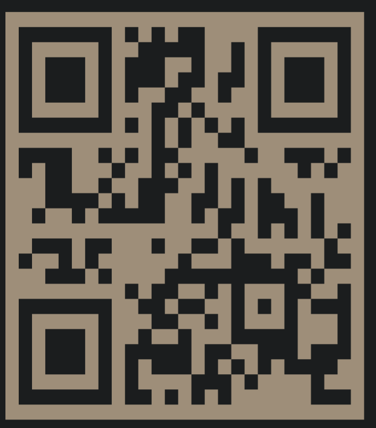

# LAB - 41

## Project: React-Native-App

### Author: Kale lesko

### Links and Resources

- [ci/cd](http://xyz.com) (GitHub Actions)
- [back-end server url](http://xyz.com) (when applicable)
- [front-end application](http://xyz.com) (when applicable)

### Setup

```
.
├── App.js
├── LICENSE
├── README.MD
├── app.json
├── assets
│   ├── adaptive-icon.png
│   ├── app.png
│   ├── favicon.png
│   ├── icon.png
│   ├── mockup.png
│   └── splash.png
├── babel.config.js
├── components
│   └── Task.js
├── package-lock.json
├── package.json
└── yarn.lock
```

#### `.env` requirements

- `"expo": "~42.0.1",`
- `"expo-status-bar": "~1.0.4",`
- `"react": "17.0.2",`
- `"react-dom": "17.0.2",`
- `"react-native": "https://github.com/expo/react-native/archive/sdk-40.0.1.tar.gz",`
- `"react-native-web": "~0.17.1"`

#### How to initialize/run your application (where applicable)

- `npm install`
- `npm start`

#### References

- https://github.com/Savinvadim1312/AmazonClone/tree/main/amplify
- https://www.youtube.com/watch?v=f687hBjwFcM
- https://www.youtube.com/watch?v=0kL6nhutjQ8
- https://www.youtube.com/watch?v=00HFzh3w1B8
- https://github.com/mattfrances/simpleReactNativeTodoList
- https://shop.byprogrammers.com/project/food-recipe-app
- https://www.youtube.com/watch?v=E1E08i2UJGI

<!-- #### How to use your library (where applicable) -->

<!-- #### Tests

- How do you run tests?
- Any tests of note?
- Describe any tests that you did not complete, skipped, etc -->

#### UML


